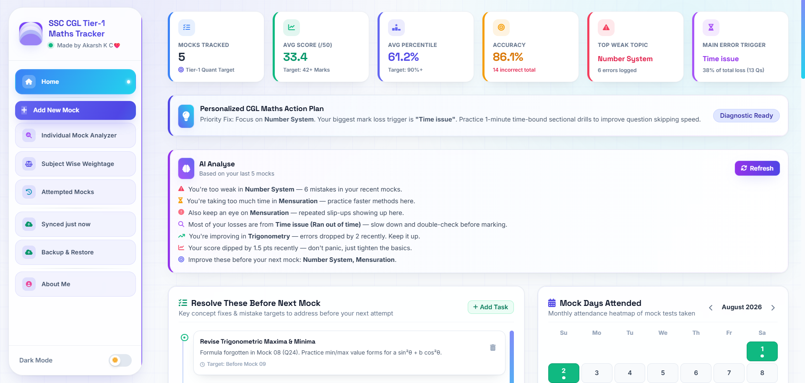
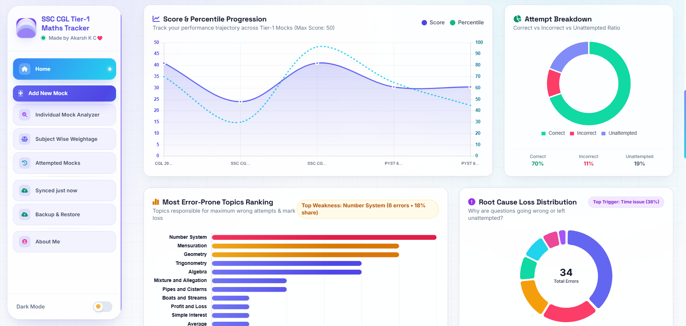
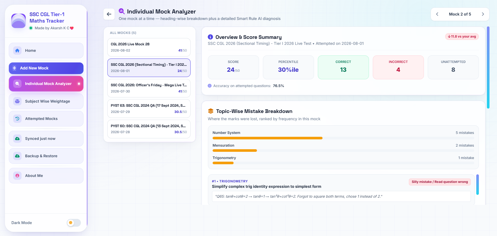
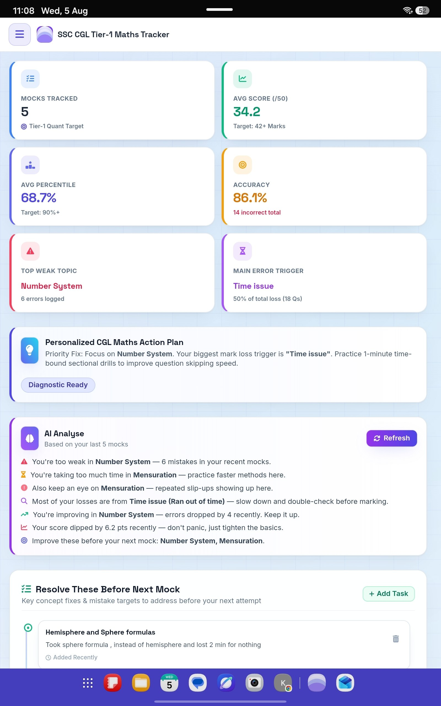
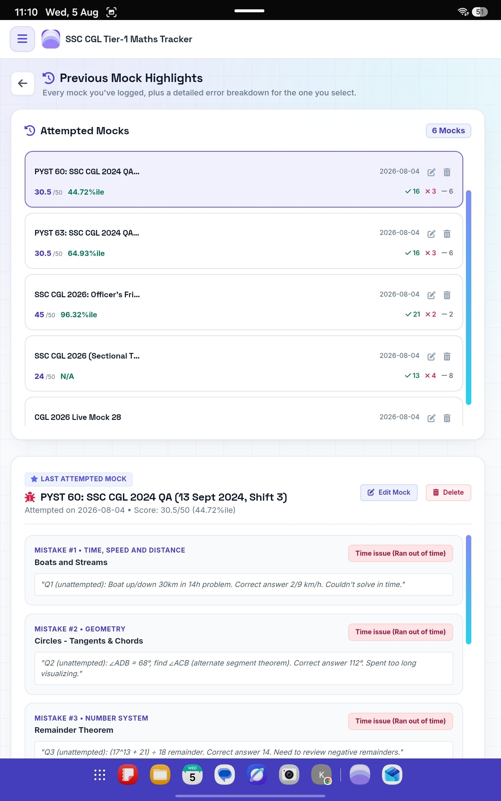

# 📊 SSC CGL Maths Tracker & Analytics

A simple tracker to log your SSC CGL Maths mock scores — topic-wise and subtopic-wise — so you can actually see where you're strong and where you need work.

🔒 **Your data stays on your own device.** Nothing is uploaded, tracked, or shared with anyone. No login, no account, no data collection — this app doesn't even ask for internet permission unless YOU choose to export your data to Google Sheets (completely optional, only if you want a backup).

🔗 **Use it now (no install needed):** [akarsh-kc.github.io/cgl-mock-tracker](https://akarsh-kc.github.io/cgl-mock-tracker/)

📱 **Or install as an app (Android):** Download the APK from the [Releases](../../releases) section  (Choose CGL.Maths.Analyser.apk
) — works just like a regular app on your phone.
### 💻 Desktop

## What it does
- Log your Maths mock scores **topic-wise and subtopic-wise** (Algebra, Geometry, Trigonometry, etc. — broken down further, not just one total score)
- Built-in smart rule-based system that helps highlight your weak areas automatically, based on your own performance patterns
- See your progress over time with clear analytics
- Works fully offline once opened — no internet needed for daily use
- Optional Google Sheets sync, only if you want to back up or view your data outside the app — entirely your choice, never automatic
### 📱 Mobile

## Why it's safe to use
- No sign-up, no account, no personal information asked
- Your mock data lives only in your own browser/phone — not on any server
- The only permission the app ever needs is internet access, and only if you turn on the optional Google Sheets export yourself

## How to use
1. Open the [live link](https://akarsh-kc.github.io/cgl-mock-tracker/) or install the app from Releases
2. Add a mock test, entering your topic-wise and subtopic-wise Maths scores
3. Check the analytics dashboard to see your strong and weak areas

---
Built by an aspirant, for aspirants. Free to use — share it with anyone preparing for SSC CGL.
